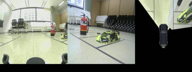

# Surround View Monitoring

### `img.zip` (Real time SVM Dataset)
2-View 실시간 SVM 데이터 셋

### `insert_car.py`
SVM 이미지에 자동차 모델 삽입 코드

### `module.py`
SVM 이미지 출력 모듈

### `main.py`
SVM 이미지 합성 코드

### 결과

